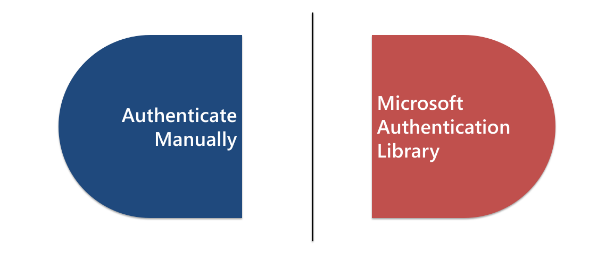
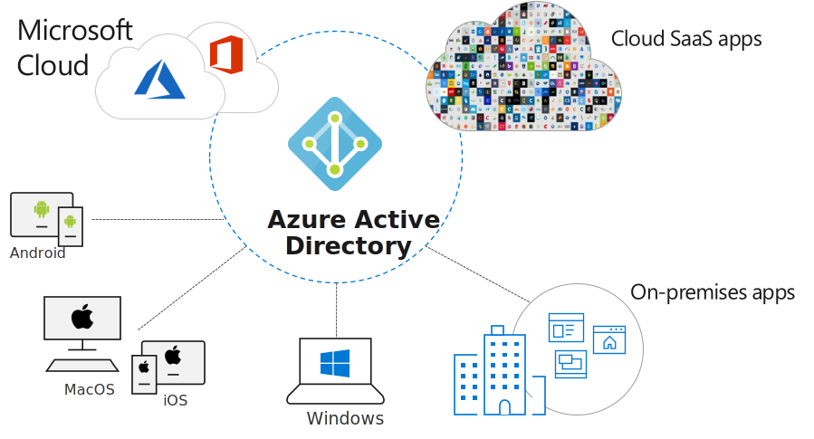
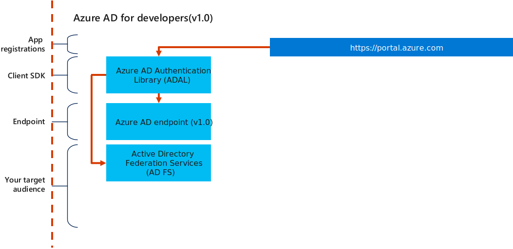
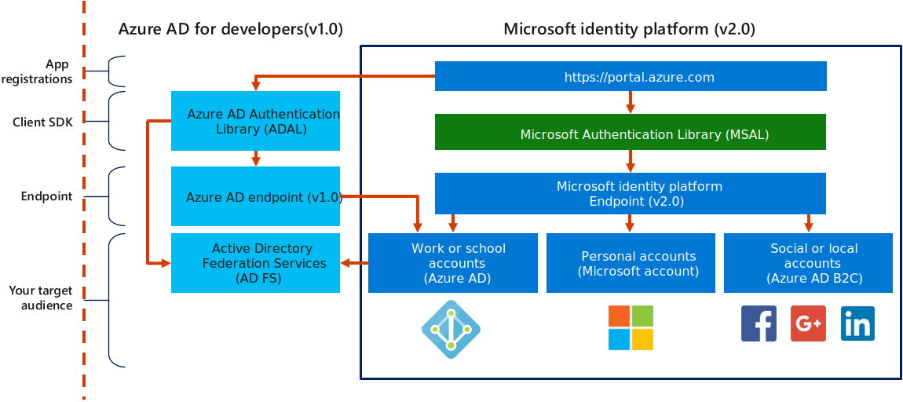
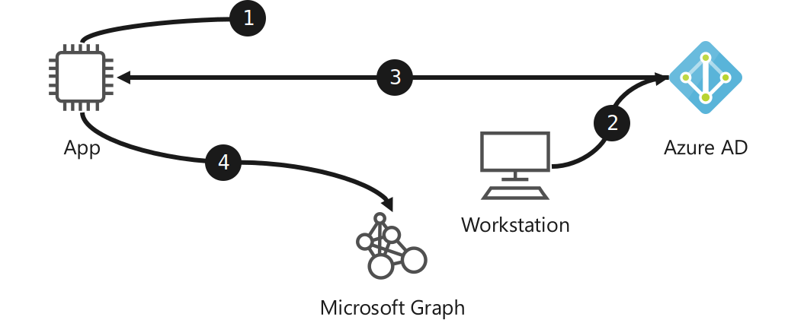

# Authenticating users in JavaScript apps with MSAL.js

## Overview

### About us

Co-Presenter Name

☁️ *Co-Presenter Title*

Co-Presenter Name

☁️ *Co-Presenter Title*

> For questions or help with this series: <MSUSDev@Microsoft.com>

All demos and source code available online:

> <https://github.com/MSUSDEV/microsoft_identity_platform_dev>

## Setting the scene

### Series roadmap

* **Session 1:**
  * **↪️ Authenticating users in JavaScript apps with MSAL.js**
* Session 2:
  * Discover Microsoft Graph Toolkit Components
* Session 3:
  * Authenticating to Azure with MSAL.js
* Session 4:
  * The Microsoft Graph SDK for JavaScript

### Today's agenda

1. What is the Microsoft Identity Platform?
1. How do we authenticate manually?
1. How can the MSAL help us authenticate?
1. Where can we use the MSAL token?

## Identity Development with the Microsoft Identity Platform

### Goal



### Identity as a control plane


### Azure Active Directory



### Active Directory Authentication Library



### Microsoft Identity Platform

**<https://docs.microsoft.com/azure/active-directory/develop/>**

> Unified full-stack development tools to work with *all Microsoft identities*.

### Microsoft Identity Platform Breakdown



## Demo: *Microsoft Identity Platform documentation*

::: notes

1. Open a browser and navigate to <https://docs.microsoft.com/en-us/azure/active-directory/develop/>

1. Review the various sections of the landing page

1. In the **About Microsoft identity platform** section, within the **Overview** sub-sectoin, selet **Microsoft identity plateform (v2.0)**

1. Review the documentation on this page

:::

## Authenticating to Microsoft

### AAD Applications

* Register applications with AAD to get access to authentication and tokens
* Usually include a redirect URI for the application
* Registration will yield client credentials required to authenticate
* Can register different types of applications

### Application Types

* Single-page applications
* Web applications
* Web APIs
* Desktop/Mobile applications
* Server-side applications

## Demo: *Registering an application in Azure AD*

::: notes

1. Open a browser and navigate to <https://portal.azure.com>

1. Navigate to **Azure Active Directory**

1. Navigate to **App registrations**

1. Create a new registration using the following settings:

    * Name: **Example**

    * Supported account types: **Accounts in any organization dirctory (Any Azure AD directory - Multitenant)**

    * Redirect URI: **Public client/native (mobile & desktop) - <http://localhost>**

1. In the new registration, navigate to the **API permissions** section

1. Observe the built-in **Microsoft Graph** permission for **User.Read**

:::

### Authentication flows

| Flow | Description |
| --- | --- |
| Authorization code | Native and web apps securely obtain tokens in the name of the user |
| Client credentials | Service applications run without user interaction |
| On-behalf-of | The application calls a service/web API, which in turns calls Microsoft Graph |
| Implicit | Used in browser-based applications |
| Device code | Enables sign-in to a device by using another device that has a browser |
| Integrated Windows | Windows computers silently acquire an access token when they are domain joined |
| Interactive | Mobile and desktops applications call Microsoft Graph in the name of a user |
| Username/password | The application signs in a user by using their username and password | |

### Interactive authentication flow


::: notes

1. The application redirects the user to the Azure AD sign-in portal, and the user acquires a token interactively from Azure AD

1. The application uses the token to access Microsoft Graph

:::

### Device code flow



::: notes

1. The application requests a unique device code from Azure AD

1. The user uses another workstation along with the device code to sign in to the Azure AD sign-in portal

1. The original application acquires a token from Azure AD based on the user sign-in

1. The application uses the token to access Microsoft Graph

:::

### Login URL

* One base URL for all login and token queries:
  * <https://login.microsoftonline.com/tenant_id/oauth2/v2.0>
* Relative URLs for specific actions:
  * **login**: \/authorize
  * **acquire token**: \/token

### Tenants

* <https://login.microsoftonline.com/tenant_id/oauth2/v2.0>
  * Unique **Tenant Id** for just your organization
  * ``organizations``: Any organizational (work/school) account
  * ``consumers``: Any Microsoft account
  * ``common``: Any account

::: notes

The different values influence the in-browser user experience when logging in. For example; if you specify the tenant id, then the user will immediately see your organization's branding.

:::

### Authorize with Azure AD using OAuth 2.0

1. Navigate to the **\/authorize** endpoint for **login.microsoftonline.com**
    1. Provide appropriate query string parameters
        * ``client_id``: Unique **Client Id** for application registration
        * ``response_type``: Set to ``code``
        * ``redirect_uri``: One of the **Redirect Uri**s specified in application registration process
        * ``scope``: List of permissions that you are requesting consent to
        * ``response_mode``: Either ``form_post`` or ``query``
        * *(Optional)* ``state``: Sanity-check value
1. Login using your browser
1. Observe the response
    1. If ``response_mode=query``, will include a unique code on the query string
        * Use this code to acquire a token
    1. (Optional) Echoes the state parameter

### Authorize Query String and URI Parameters

| Parameter | Description |
| --- | --- |
| ``client_id`` | AAD application unique identifier |
| ``response_type`` | Usually ``code`` |
| ``redirect_uri`` | Where to go after authentication |
| ``response_mode`` | Usually ``query`` but can be ``form_post`` |
| ``scope`` | What permissions are required |
| ``state`` (optional) | Value that can be used to validate response |

### Example Authorization Request

```sh
GET https://login.microsoftonline.com/organizations/oauth2/v2.0/authorize?
    client_id=06b9debd-a372-496f-916c-856dc9dd1f8a
    &response_type=code
    &redirect_uri=http%3A%2F%2Flocalhost%2F
    &response_mode=query
    &scope=user.read
    &state=demo
```

### Example Authorization Response

```sh
GET http://localhost?
    code=6a3095c1-48ca-4d00-939e-eca0e5b8f1a4
    &state=demo
```

### Acquire a Bearer Token using OAuth 2.0

1. Send a **POST** request to the **\/token** endpoint for **login.microsoftonline.com**
    1. Provide appropriate form parameters
        * ``client_id``: Unique **Client Id** for application registration
        * ``redirect_uri``: One of the **Redirect Uri**s specified in application registration process
        * ``scope``: List of permissions that you are requesting consent to
        * ``code``: Use the value of the **code** from the authorization request
        * ``grant_type``: Use ``authorization_code``
1. Observe the response
    1. The ``access_token`` property has your OAuth 2.0 Bearer token

### Token Query String and URI Parameters

| Parameter | Description |
| --- | --- |
| ``client_id`` | AAD application unique identifier |
| ``code`` | Code from previous request |
| ``grant_type`` | ``authorization_code`` |
| ``redirect_uri`` | Where to go after authentication |
| ``scope`` | What permissions are required |

### Example Token Request

```sh
POST https://login.microsoftonline.com/organizations/oauth2/v2.0/token?
    client_id=06b9debd-a372-496f-916c-856dc9dd1f8a
    &redirect_uri=http%3A%2F%2Flocalhost%2F
    &grant_type=authorization_code
    &code=OAAABAAAAiL9Kn2Z27UubvWFPbm0gLWQJVzCTE9UkP3pSx1aXxUjq3n8b2JRLk4OxVXr...
```

::: notes

The ``code`` value has been concatenated for brevity.

:::

### Example Token Response

```js
{
    "token_type": "Bearer",
    "scope": "user.read",
    "expires_in": 3600,
    "access_token": "eyJ0eXAiOiJKV1QiLCJhbGciOiJSUzI1NiIsIng1dCI6Ik5HVEZ2ZEstZnl0aEV1Q...",
    "refresh_token": "AwABAAAAvPM1KaPlrEqdFSBzjqfTGAMxZGUTdM0t4B4..."
}
```

::: notes

The ``access_token`` and ``refresh_token`` values have been concatenated for brevity.

:::

## Demo: *Manually acquiring a token from Microsoft*

::: notes

1. Open a browser and navigate to <https://portal.azure.com>

1. Navigate to **Azure Active Directory**

1. Native to your recently created application registration

1. Record the value of the **Client Id** field

1. Build a URL using the following steps:

    1. Start with ``https://login.microsoftonline.com/common/oauth2/v2.0/authorize``

    1. Add the ``client_id=`` query string value with your unique **Client Id** from the application registration

    1. Add the ``&redirect_uri=http%3A%2F%2Flocalhost%2F`` query string parameter

    1. Add the ``&scope=user.read`` query string parameter

    1. Add the ``&response_type=code`` query string parameter

    1. Add the ``&response_mode=query`` query string parameter

1. Open a browser and navigate to the URL that you just built

1. Login using any organizational (work/school) account

1. Consent to the application's request to view your user profile information (``user.read``)

1. Azure AD will redirect to localhost which should return a HTTP 404 error

1. Record the value of the redirect URL that is in the browser address bar

1. Record the value of the ``code`` query string parameter in the response

1. Open a HTTP request tool

    * *Note: It is recommended to use [Postman](https://www.postman.com/) to demo the HTTP POST request*

1. Build a HTTP **POST** request using the endpoint ``https://login.microsoftonline.com/common/oauth2/v2.0/token`` and following these steps:

    1. Add a ``client_id`` parameter with your unique **Client Id** from the application registration

    1. Add a ``code`` parameter with the **code** you recorded earlier in this lab

    1. Add a ``redirect_uri`` parameter with a value of ``http://localhost``

    1. Add a ``scope`` parameter with a value of ``user.read``

    1. Add a ``grant_type`` parameter with a value of ``authorization_code``

    1. Issue the HTTP POST request

1. Observe the JSON response of the request, it should contain an ``access_token`` property with your MSAL token

1. Build a HTTP **GET** request using the endpoint ``https://graph.microsoft.com/beta/me`` and following these steps:

    1. Add an **OAuth 2.0** bearer token header using your **Access Token** created earlier.

    1. Issue the HTTP GET request

1. Observe the result of the request

:::

## Microsoft Authentication Library (MSAL)

### MSAL SDK

**<https://docs.microsoft.com/azure/active-directory/develop/msal-overview>**

* Consistent single library for authentication with *all Microsoft identities*
* Can be used to access:
  * Microsoft Graph
  * other Microsoft APIs
  * third-party Web APIs
  * your own APIs
* Available in various programming languages and platforms:
  * .NET
  * JavaScript
  * Python
  * Java
  * Android/iOS

### Node Package Manager

* Available on NPM
  * Vanilla JavaScript 1.0
    * **[@azure/msal](https://www.npmjs.com/package/@azure/msal)**
  * In-Browser JavaScript 2.0 (Preview)
    * **[@azure/msal-browser](https://www.npmjs.com/package/@azure/msal-browser)**
  * Angular
    * **[@azure/msal-angular](https://www.npmjs.com/package/@azure/msal-angular)**

### UserAgentApplication

* **Public client applications**
  * Applications always sign-in users
    * Sign-in using **redirect** or **popup**
  * Point of configuration for the application
  * Examples:
    * Single-page apps
    * Server-side web applications

### UserAgentApplication Instantiation

```js
var client = new Msal.UserAgentApplication(
    ...
);
```

### Auth Options

```js
var client = new Msal.UserAgentApplication({
    auth: {
        clientId: '<client-id>',
        authority: 'https://login.microsoftonline.com/<authority>',
        redirectUri: '<redirect-uri>'
    }
});
```

### Cache Options

```js
var client = new Msal.UserAgentApplication({
    cache: {
        cacheLocation: 'localStorage' <or> 'sessionStorage'
    }
});
```

### Building a request

```js
var request = {
    scopes: [ 'user.read' ]
}
```

### Logging in interactively

```js
var response = await client.loginPopup(request);
```

### Acquring a token interactively

```js
var response = await client.acquireTokenSilent(request);
```

## Demo: *Browser-based interactive authentication using MSAL.JS*

::: notes

1. Open a browser and navigate to <https://portal.azure.com>

1. Navigate to **Azure Active Directory**

1. Navigate to your recently created application registration


1. Navigate to the **Authentication** section

1. Add a new platform with the following settings:

    * Platform: **Web**

    * Redirect URIs **<http://localhost:8080>**

    * Implicit grant **Access tokens** & **ID tokens**

1. Save the platform configuration changes

1. Open **Visual Studio Code** in an empty folder

1. Run ``git clone https://gist.github.com/seesharprun/d87f6ddd74d7711a0d4249268a2c94ca .`` to clone the sample Node.js web application

1. Run ``npm install`` to install the Node.js dependencies

1. Run ``npm start`` to start the web server and observe the server URL

1. Open a browser and navigate to the URL specified in the previous step

    * *This is typically ``http://localhost:8080``*

1. Observe the basic web application

1. Open the developer tools for your browser

1. Click the **Run Code** button and observe the console message

1. Return to **Visual Studio Code**

1. Open the **index.html** file

1. In the HTML file's header, add the following element to reference the **MSAL.JS v1.3.0** library: ``<script type="text/javascript" src="https://alcdn.msauth.net/lib/1.3.0/js/msal.js"></script>``

1. Open the **index.js** file

1. Add the code for this file:

    ```js
    const config = {
        auth: {
            clientId: '<client-id>',
            authority: 'https://login.microsoftonline.com/common/',
            redirectUri: 'http://localhost:8080'
        }
    };
    var client = new Msal.UserAgentApplication(config);
    var request = {
        scopes: [ 'user.read' ]
    };
    let loginResponse = await client.loginPopup(request);
    console.dir(loginResponse);
    ```

1. Return to and refresh your browser window

1. Observe the updated messages in the console

1. Return to the **index.js** file in **Visual Studio Code** and add the following code:

    ```js
    let tokenResponse = await client.acquireTokenSilent(request);
    console.dir(tokenResponse);
    ```

1. Return to and refresh your browser window

1. Observe the updated messages in the console

1. Return to the **index.js** file in **Visual Studio Code** and add the following code:

    ```js
    let payload = await fetch("https://graph.microsoft.com/beta/me", {
        headers: {
            'Authorization': 'Bearer ' + tokenResponse.accessToken
        }
    });
    let json = await payload.json();
    console.dir(json);
    ```

1. Return to and refresh your browser window

1. Observe the updated messages in the console

:::
